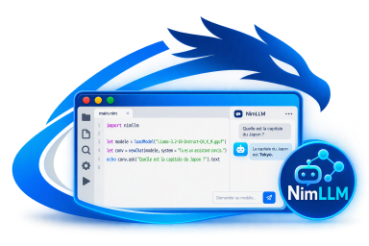

<div align="center">

[]()

# nimllm

**Faire tourner, ajuster et créer des modèles de langage en Nim pur.**
Aucune dépendance : ni llama.cpp, ni Python, ni BLAS, ni bibliothèque C.

[](https://nim-lang.org)
[](#installation)
[](docs/12-gguf-et-quantification.md)
[](LICENCE.md)
[](nimllm-doc-fr.md)
[](nimllm-doc-en.md)

[Démarrage rapide](#démarrage-rapide) ·
[Fonctionnalités](#fonctionnalités) ·
[Documentation](#documentation) ·
[Exemples](#exemples) ·
[Limites](#limites) ·
[Licence](#licence)

</div>

---

```nim
import nimllm

let modele = loadModel("Llama-3.2-1B-Instruct-Q4_K_M.gguf")
let conv = newChat(modele, system = "Tu es un assistant concis.")
echo conv.ask("Quelle est la capitale du Japon ?").text
# La capitale du Japon est Tokyo.
```

nimllm lit les fichiers **GGUF** (le format de llama.cpp, Ollama et LM Studio) et
fournit tout le nécessaire pour :

- **dialoguer** avec un modèle : contexte, historique, pièces jointes, réponse en
  texte, JSON, image ou audio ;
- **ajuster** un modèle existant comme Llama 3.2 sur vos données avec LoRA ;
- **créer** un nouveau modèle de zéro : tokeniseur, architecture, entraînement,
  export en GGUF utilisable partout.

## Démarrage rapide

### Installation

Il faut [Nim 2.0 ou plus récent](https://nim-lang.org/install.html) et un compilateur C.

```sh
git clone https://github.com/<votre-compte>/nimllm.git
cd nimllm
nimble install          # ou, sans installation : nim c --path:src ...
```

### Vérifier que tout fonctionne (sans modèle)

```sh
nim c -r tests/t_complet.nim
```

Ce test crée un tokeniseur et entraîne un petit modèle. Il l'exporte en GGUF, le
quantifie et dialogue avec lui. Il vérifie aussi les sorties image, audio et
JSON. Il dure environ 30 secondes.

### Utiliser un vrai modèle

Téléchargez un modèle GGUF, par exemple **Llama 3.2 1B Instruct Q4_K_M**
(~0,8 Go) sur Hugging Face. Si vous utilisez déjà Ollama, ses modèles sont des
GGUF (voir [installation](docs/01-installation.md#13-obtenir-un-modèle)).

```sh
export NIMLLM_MODEL=~/models/Llama-3.2-1B-Instruct-Q4_K_M.gguf

nim c -r examples/ex01_bonjour.nim          # une question, une réponse
nim c -r examples/ex04_chat_terminal.nim    # assistant interactif complet
nim c -r examples/ex17_creer_modele.nim     # créer son propre modèle (~2 min, aucun téléchargement)
```

> [!IMPORTANT]
> Compilez toujours avec `-d:release`. Le `config.nims` des exemples le fait pour
> vous. En mode debug, le calcul est 10 à 30 fois plus lent.

## Fonctionnalités

| Domaine | Ce qui est pris en charge |
|---|---|
| **Modèles** | GGUF v2/v3 mappé en mémoire. Architectures `llama` (Llama 2, 3, 3.1, 3.2, Mistral, TinyLlama…), `qwen2`, `qwen3`. Poids F32, F16, BF16, Q8_0, Q4_0, Q4_1, Q5_0, Q5_1, Q2_K à Q6_K |
| **Tokeniseurs** | BPE niveau octet (Llama 3, Qwen, GPT-2) et SentencePiece (Llama 2, Mistral) |
| **Dialogue** | Prompt système, historique multi-tours, gabarits Llama 3, ChatML, Mistral, Llama 2, Gemma, Phi-3. Cache KV réutilisé, débordement de contexte géré, sauvegarde et reprise, annuler, régénérer, prolonger |
| **Génération** | Flux token par token, température, top-k, top-p, min-p, pénalités, graine, chaînes d'arrêt, biais de logits |
| **Pièces jointes** | Texte, code, CSV, JSON, Markdown, HTML, PDF (texte extrait), PNG, BMP, PPM (décodés), JPEG, GIF, WebP (dimensions), WAV |
| **Formats de réponse** | Texte, Markdown, JSON (validé, avec nouvelles tentatives), **image** (SVG rastérisé en BMP), **audio** (WAV par synthèse vocale), **fichier** |
| **Outils** | Embeddings, recherche sémantique (RAG), perplexité, appel d'outils (agents) |
| **Apprentissage** | Tenseurs à différentiation automatique, AdamW, SGD, taux cosinus, écrêtage, accumulation de gradients, points de sauvegarde |
| **Ajustement** | LoRA sur un modèle quantifié, appliqué à la volée ou fusionné dans un nouveau GGUF |
| **Création** | Tokeniseur BPE, Transformer de type Llama configurable, pré-entraînement, ajustement au dialogue, export GGUF, quantification |

<details>
<summary><b>Quelques exemples d'API</b></summary>

**Réponse en flux et pièce jointe**

```nim
let r = conv.ask("Quel poste dépasse le budget ?",
                 attachments = @[attach("budget.csv")],
                 onToken = proc (s: string): bool = (stdout.write s; true))
```

**Réponse structurée en JSON**

```nim
let fiche = conv.askJson("Extrais les informations de cette annonce : ...",
  schema = """{"objet": str, "prix_euros": int, "ville": str}""")
echo fiche["prix_euros"].getInt
```

**Image et audio**

```nim
discard conv.ask("Dessine une maison et un soleil.", format = ofImage, outPath = "maison.svg")   # .svg + .bmp
discard conv.ask("Souhaite une bonne journée.", format = ofAudio, outPath = "bonjour.wav")
```

**Ajustement LoRA de Llama 3.2**

```nim
let m = loadForTraining("Llama-3.2-1B-Instruct-Q4_K_M.gguf", tmLora, defaultLora())
let donnees = loadChatJsonl("faq.jsonl", m.tokenizer, detectTemplate(m.tokenizer))
discard m.train(donnees, defaultTrainConfig())
m.saveLora("faq.lora.gguf")
mergeLora("Llama-3.2-1B-Instruct-Q4_K_M.gguf", "faq.lora.gguf", "llama-faq.gguf")
```

**Nouveau modèle de zéro**

```nim
let tok = trainBpe([corpus], vocabSize = 2000)
let m = newTransformer(newModelConfig(tok.vocabSize, dim = 256, layers = 6, heads = 8), tok)
discard m.train(newTextDataset(tok, corpus), defaultTrainConfig())
m.saveGguf("mon-modele.gguf")      # utilisable avec nimllm, llama.cpp, Ollama…
```

</details>

## Documentation

La documentation est en français et **progressive** : chaque chapitre s'appuie
sur le précédent, du premier « bonjour » à la création d'un modèle. Chaque
chapitre contient des programmes complets, prêts à compiler.

| | Chapitre | Contenu |
|---|---|---|
| 🟢 | [01 Installation](docs/01-installation.md) | Nim, compilation, choix d'un modèle, mémoire |
| 🟢 | [02 Premiers pas](docs/02-premiers-pas.md) | Question, réponse en flux, erreurs |
| 🟢 | [03 Conversation et contexte](docs/03-conversation-et-contexte.md) | Prompt système, historique, sauvegarde, fenêtre de contexte |
| 🟡 | [04 Réglages de la génération](docs/04-reglages-generation.md) | Température, top-k/p, répétitions, reproductibilité |
| 🟡 | [05 Pièces jointes](docs/05-pieces-jointes.md) | Texte, CSV, PDF, images, sons |
| 🟡 | [06 Formats de réponse](docs/06-formats-de-reponse.md) | JSON, image, audio, fichier |
| 🟡 | [07 Cas pratiques](docs/07-cas-pratiques.md) | RAG, résumé de longs documents, agents, serveur HTTP |
| 🟠 | [08 Sous le capot](docs/08-sous-le-capot.md) | Tokens, logits, cache KV, gabarits, embeddings |
| 🟠 | [09 Bases de l'apprentissage](docs/09-apprentissage-bases.md) | Tenseurs, gradients, optimiseurs |
| 🔴 | [10 Ajuster avec LoRA](docs/10-ajuster-avec-lora.md) | Spécialiser Llama 3.2 sur vos données |
| 🔴 | [11 Créer un modèle](docs/11-creer-un-modele.md) | Tokeniseur, architecture, pré-entraînement, export |
| 🔴 | [12 GGUF et quantification](docs/12-gguf-et-quantification.md) | Inspecter, écrire, quantifier des modèles |
| ⚙️ | [13 Performances et dépannage](docs/13-performances-et-depannage.md) | Vitesse, threads, erreurs fréquentes |
| 📖 | [14 Référence de l'API](docs/14-reference-api.md) | Toutes les fonctions publiques |

🟢 débutant · 🟡 intermédiaire · 🟠 avancé · 🔴 expert

## Exemples

Les 20 programmes du dossier [`examples/`](examples/) compilent et s'exécutent tels quels.

| Fichier | Sujet | Fichier | Sujet |
|---|---|---|---|
| `ex01_bonjour` | Première question | `ex11_bas_niveau` | Tokens, logits, boucle manuelle |
| `ex02_flux` | Réponse en flux, vitesse | `ex12_rag` | Questions sur vos documents |
| `ex03_conversation` | Contexte, historique, sauvegarde | `ex13_resume_long` | Résumé « map-reduce » |
| `ex04_chat_terminal` | Assistant interactif | `ex14_outils` | Agent avec appel de fonctions |
| `ex05_parametres` | Réglages d'échantillonnage | `ex15_autograd` | Gradients, régression, XOR |
| `ex06_pieces_jointes` | CSV, code, images, PDF | `ex16_tokeniseur` | Entraîner un tokeniseur |
| `ex07_json` | Extraction structurée | `ex17_creer_modele` | Créer un modèle de A à Z |
| `ex08_image` | Image (SVG → BMP), dessin | `ex18_lora` | Ajustement LoRA |
| `ex09_audio` | Synthèse vocale, mélodie | `ex19_gguf_quantification` | Inspection, quantification |
| `ex10_fichier` | Génération de fichiers | `ex20_reprise_entrainement` | Points de sauvegarde, reprise |

## Fiabilité

Le moteur a été comparé à l'implémentation de référence
[llama.cpp](https://github.com/ggml-org/llama.cpp) :

- **Tokeniseurs** : les cas de test officiels de llama.cpp (Llama 3, Llama 2,
  Qwen 2, GPT-2, Phi-3, DeepSeek) donnent exactement les mêmes tokens.
- **Déquantification** : identique bit à bit à la référence `gguf-py`, pour tous
  les formats.
- **Inférence** : génération déterministe identique token pour token à llama.cpp
  (architectures llama et qwen2 ; formats F32, F16, BF16, Q8_0, Q4_0, Q4_K, Q5_K).
- **Export** : les modèles créés, quantifiés ou fusionnés par nimllm se chargent
  dans llama.cpp et y donnent les mêmes réponses.
- **Différentiation automatique** : chaque opération est vérifiée par
  différences finies.

```sh
nim c -r tests/t_complet.nim                            # bout en bout, autonome
nim c -r tests/t_grad.nim                               # gradients
LLAMA_CPP=~/src/llama.cpp nim c -r tests/t_tok.nim      # tokeniseurs vs llama.cpp
```

## Architecture

```
src/
├── nimllm.nim            module principal (importe tout)
└── nimllm/
    ├── gguf.nim          lecture / écriture GGUF
    ├── quant.nim         formats quantifiés, produits scalaires entiers
    ├── tokenizer.nim     BPE et SentencePiece
    ├── model.nim         inférence : cache KV, RoPE, attention groupée, LoRA à la volée
    ├── sampler.nim       échantillonnage
    ├── chat.nim          conversation, gabarits, formats de réponse
    ├── attachments.nim   pièces jointes (avec inflate.nim pour PNG et PDF)
    ├── image.nim         images BMP/PPM, dessin, rendu SVG
    ├── audio.nim         WAV, synthèse vocale par formants, mélodies
    ├── autograd.nim      tenseurs différentiables
    ├── nn.nim            Transformer entraînable, LoRA, export
    ├── train.nim         optimiseurs, jeux de données, boucle d'entraînement
    ├── tokentrain.nim    apprentissage de tokeniseurs BPE
    └── parallel.nim      pool de threads
```

## Limites

- **Processeur uniquement**, sans GPU. Sur 12 cœurs, un modèle de la
  taille de Llama 3.2 1B Q4_K_M génère environ 65 à 70 tokens/s (sur un mac mimi M5 Pro).
- **Entrées image et audio** : Llama 3.2 1B/3B est un modèle textuel. Les
  fichiers joints lui sont *décrits* (dimensions, couleurs, aperçu, durée), il
  ne les perçoit pas.
- **Sortie image** : le modèle écrit du SVG, que nimllm rastérise. La qualité du
  dessin dépend de la taille du modèle.
- **Sortie audio** : synthèse vocale par formants, intelligible mais robotique.
- **Entraînement** : réaliste sur processeur pour de petits modèles et pour LoRA.
  Sur 2 cœurs, un pas LoRA sur Llama 3.2 1B (lot de 128 tokens) prend environ 30 s.
- **Non pris en charge** : Gemma, Phi-3, modèles Mixture-of-Experts, modèles
  multimodaux, formats IQ* (i-quants).

## Contribuer

Les signalements de bugs et les propositions sont bienvenus dans les *issues*.
Pour un problème de modèle, joignez la sortie de :

```nim
echo openGguf("modele.gguf").describe()
```

Avant de proposer une modification, vérifiez que `nim c -r tests/t_complet.nim`
et `nim c -r tests/t_grad.nim` passent. Toute contribution est publiée sous les
conditions de [`LICENCE.md`](LICENCE.md).

## Licence

nimllm est distribué sous **[CC BY-NC-SA 4.0](https://creativecommons.org/licenses/by-nc-sa/4.0/deed.fr)**
(© sonaliwan.fr). Quelques portions tierces restent sous leur propre licence
(MIT, Unicode v3, zlib) : le détail figure dans [`LICENCE.md`](LICENCE.md) et
les textes dans [`LICENSES/`](LICENSES/).

**Usage commercial** : une licence commerciale peut être acquise auprès de
**sonaliwan.fr** à l'adresse [metalab@sonaliwan.fr](mailto:metalab@sonaliwan.fr).

Les modèles utilisés avec nimllm ont leur propre licence, par exemple la
*Llama 3.2 Community License* de Meta.

## Remerciements

- [llama.cpp / ggml](https://github.com/ggml-org/llama.cpp) : format GGUF,
  formats de quantification et algorithmes de tokenisation (MIT).
- [GPT-2](https://github.com/openai/gpt-2) : codage BPE niveau octet.
- [zlib / puff.c](https://github.com/madler/zlib) : décodage DEFLATE.
- [Unicode Character Database](https://www.unicode.org/ucd/) : catégories de caractères.
